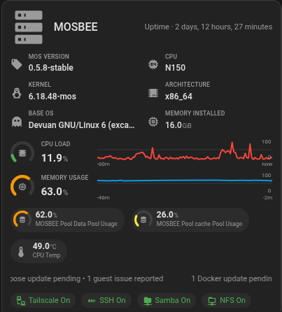

# MOS Card Addons

Three Home Assistant Lovelace cards for
[ha-mos](https://github.com/anym001/ha-mos), the Home Assistant NAS
integration, and its companion
[ha-mos-card](https://github.com/anym001/ha-mos-card) — distributed
together as one HACS plugin:

| Card                                                                            | Description                                                                                                                                                                                                                                                    |
| ------------------------------------------------------------------------------- | -------------------------------------------------------------------------------------------------------------------------------------------------------------------------------------------------------------------------------------------------------------- |
| [mos-kind-title-card](packages/mos-card-addons/docs/kind-title-card.md)         | A compact title-bar card summarizing one virtualization kind (Docker, Compose Stacks, LXC, VMs): running/total counts, update/problem badges, and a memory gauge.                                                                                              |
| [mos-server-summary-card](packages/mos-card-addons/docs/server-summary-card.md) | A per-server summary card: identity/version info, live CPU/memory gauges with history, storage pool usage, CPU temperature, and network/service/disk status.                                                                                                   |
| [mos-detail-card](packages/mos-card-addons/docs/detail-card.md)                 | A single-device detail card: point it at one device_id and it auto-detects a Docker/Compose/LXC/VM guest, storage pool, disk, or the server itself, with stats, history, status, and a power toggle. Designed to be opened via popup from the other two cards. |

## Screenshots




_See each card's own doc page (linked above) for more screenshots (layout
variants, GUI editor)._

## Installing

**Most users — via [HACS](https://hacs.xyz):**

1. HACS → ⋮ → Custom repositories → add this repository's URL, category
   "Dashboard".
2. Install "MOS Card Addons", then add the Lovelace resource it registers.
3. Add any of the three cards — `type: custom:mos-kind-title-card`,
   `custom:mos-server-summary-card`, or `custom:mos-detail-card` — via the
   GUI editor (Add Card → search "MOS") or YAML. See each card's doc page
   above for its full configuration reference.

**Manual install (no auto-updates):**

1. Download `mos-card-addons.js` from the
   [latest release](../../releases/latest).
2. Copy it to `<config>/www/community/mos-card-addons/mos-card-addons.js`.
3. Settings → Dashboards → ⋮ → Resources → Add Resource: URL
   `/local/community/mos-card-addons/mos-card-addons.js`, type "JavaScript
   Module".

## Requirements

- Node.js 18+ (for building from source only — a HACS/manual install needs
  no build tooling).
- The [ha-mos](https://github.com/anym001/ha-mos) integration installed and
  configured in Home Assistant.
- Sensor history recorded by Home Assistant's recorder (on by default) for
  the CPU/memory/pool-usage sparklines in mos-server-summary-card and
  mos-detail-card.
- mos-kind-title-card's running/total/updates counts need an `ha-mos`
  version including [PR #114](https://github.com/anym001/ha-mos/pull/114)
  (merged 2026-09-10); on an older integration version those rows are
  simply omitted.

## Building from source

```bash
npm install
npm run dev --workspace=packages/mos-card-addons    # vite build --watch
npm run build --workspace=packages/mos-card-addons  # one-shot build -> dist/mos-card-addons.js
npm run deploy --workspace=packages/mos-card-addons # build + scp to a HA instance (see .env.example)
```

Home Assistant loads the card as a plain JS module resource, so there's no
hot-reload into the HA frontend itself — after each build, get the file
onto your HA instance and hard-refresh the browser (module scripts are
cached aggressively; a stale console version banner is the most common
"why isn't my change showing up" symptom).

## Contributing

```bash
npm run lint
npm run typecheck
npm run lint:md
npm run format
```

A pre-commit hook runs these (scoped to staged files) automatically.
Commits must follow [Conventional Commits](https://www.conventionalcommits.org/)
(`fix:`, `feat:`, `chore:`, ...), optionally scoped to the card they touch
(`fix(detail-card): ...`) — a commit-msg hook enforces this, and
[release-please](https://github.com/googleapis/release-please) uses it to
automate version bumps and [CHANGELOG.md](packages/mos-card-addons/CHANGELOG.md).
See [CLAUDE.md](CLAUDE.md) for the full architecture and release flow.

## License

[MIT](LICENCE.md)
