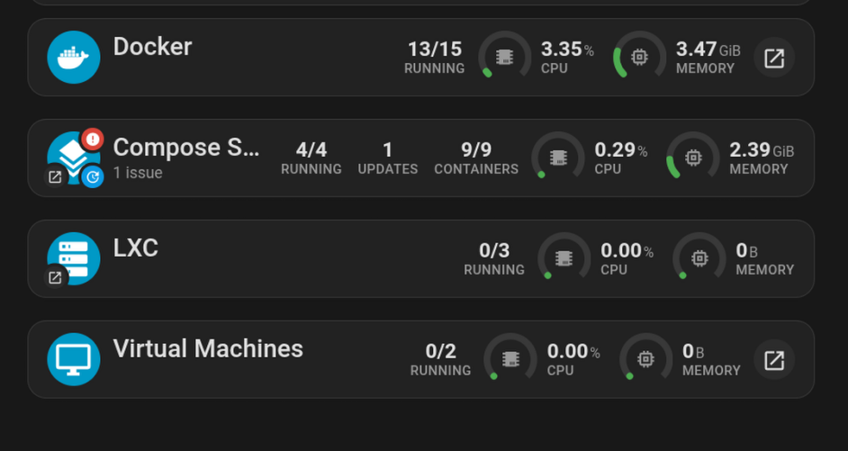

# ha-mos-card-addons

A monorepo of Lovelace card addons for
[ha-mos](https://github.com/anym001/ha-mos), the Home Assistant NAS
integration, and its companion
[ha-mos-card](https://github.com/anym001/ha-mos-card).

## Packages

| Package                                                     | Description                                                                                                                                                       |
| ----------------------------------------------------------- | ----------------------------------------------------------------------------------------------------------------------------------------------------------------- |
| [mos-kind-title-card](packages/mos-kind-title-card)         | A compact title-bar card summarizing one virtualization kind (Docker, Compose Stacks, LXC, VMs): running/total counts, update/problem badges, and a memory gauge. |
| [mos-server-summary-card](packages/mos-server-summary-card) | A per-server summary card: identity/version info, live CPU/memory gauges with history, storage pool usage, CPU temperature, and network/service/disk status.      |

Each package is built and distributed independently (its own `dist/`
bundle, HACS metadata, and README) so it can be installed as a standalone
Lovelace resource.

## Screenshots



_See each package's own README for more screenshots (layout variants, GUI editor) of that card._

## Suggested deployment

- **Most users:** install a package via [HACS](https://hacs.xyz) as a
  custom repository rather than building from source — see that
  package's README for its HACS setup and install steps.
- **Developers:** clone this repo and use the npm workspace commands
  below to build/deploy a package from source.

## Requirements

- Node.js 18+
- The [ha-mos](https://github.com/anym001/ha-mos) integration installed and
  configured in Home Assistant.

## Setup

```bash
npm install
```

This installs dependencies for all packages via npm workspaces.

## Working on a package

```bash
npm run dev --workspace=packages/mos-kind-title-card
npm run build --workspace=packages/mos-kind-title-card
npm run deploy --workspace=packages/mos-kind-title-card
```

See each package's own README for details on its build, deploy, and HACS
setup.

## Contributing

```bash
npm run lint
npm run typecheck
npm run lint:md
npm run format
```

A pre-commit hook runs these (scoped to staged files) automatically.
Commits must follow [Conventional Commits](https://www.conventionalcommits.org/)
(`fix:`, `feat:`, `chore:`, ...) — a commit-msg hook enforces this, and
[release-please](https://github.com/googleapis/release-please) uses it to
automate version bumps and changelogs. See [CLAUDE.md](CLAUDE.md) for
details.

## License

[MIT](LICENCE.md)
