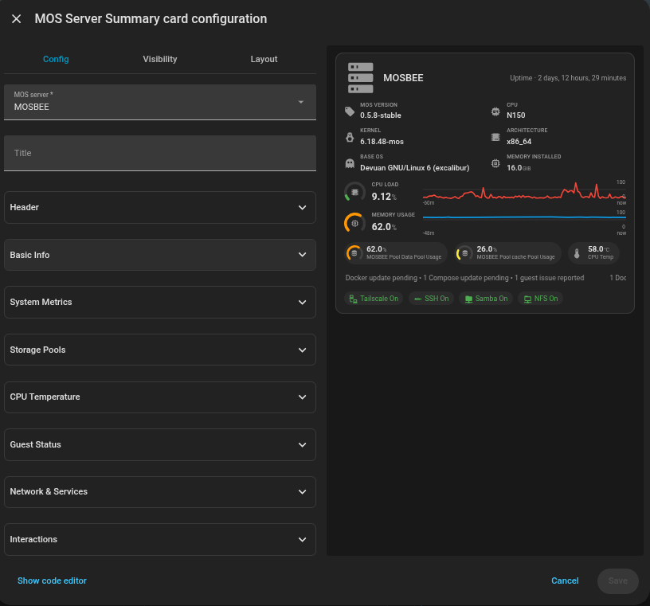

# MOS Server Summary Card

A compact Home Assistant Lovelace summary card for one
[ha-mos](https://github.com/anym001/ha-mos) server: a custom, resizable
header image and hostname, boot time or uptime, a compact identity/version
grid (MOS version with an update indicator, CPU, kernel, architecture, base
OS, memory installed), live CPU load and memory usage — each a color-coded
gauge plus a history sparkline with optional value/time scales — storage
pool usage with editable labels, CPU temperature, a guest updates/problems
section, and a network/service/disk-health status section. Every
below-header section is independently optional, choosable in layout, and
reorderable.

Deliberately excludes per-guest Docker/Compose/LXC/VM detail — that's
[mos-kind-title-card](kind-title-card.md)'s job — beyond the guest status
section, which only ever summarizes counts/messages across all guests,
never per-guest detail.

See the [repo README](../../../README.md) for installation. This page covers usage/configuration.

## Screenshots

**The card:**


**GUI editor:**



## Requirements

Sensor history recorded by Home Assistant's recorder (on by default) for
the CPU load / memory usage sparklines — a fresh install with no history
yet just shows the gauges without a trend line until some accumulates.

## Usage

```yaml
type: custom:mos-server-summary-card
server: 1a2b3c4d5e6f7890abcdef1234567890
title: MOSBEE
image: /local/mosbee-logo.png
```

## GUI editor

Add Card → "MOS Server Summary Card" opens a visual editor built on Home
Assistant's native `ha-form`/selector components. With ~30 options, fields
are grouped into expandable sections (only a toggle's own sub-options — an
action picker, a style select — appear once that toggle is switched on):

- **MOS server** / **Title** — always visible; server picker + optional
  name override.
- **Header** — header image URL, its size (a 24–96px slider), whether to
  show the boot-time/uptime line, and (once that's on) its display style.
- **Basic Info** — on/off, and once on: its layout (icon grid, chip row,
  label:value list, or a single line).
- **System Metrics** — CPU load / memory usage gauges, on/off each, the
  sparkline history window (1/3/6/12/24h), and the sparkline's optional
  value scale (faint 0/50/100% reference) and time scale (tick labels for
  the actual window shown).
- **Storage Pools** — on/off, and once on: per-pool label overrides and the
  shared pool tap/hold/double-tap actions (see **Interactivity** below).
- **CPU Temperature** — on/off, and once on: its own tap/hold/double-tap
  action overrides (see **Interactivity** below).
- **Guest Status** — on/off, and once on: its display style.
- **Network & Services** — network/service/disk-health toggles, and once
  services are on: the status section's display style.
- **Interactions** — the whole-card tap/hold/double-tap actions.

No entity pickers beyond the server itself: every other entity the card
needs is discovered automatically from the device and entity registries.

`section_order` (see YAML below) is deliberately **not** a GUI field — a
reorderable list of five items added little value over just editing the
array directly, so it's set via the card's YAML/code editor (Add Card → ⋮ →
"Edit in YAML", or the "Show code editor" link at the bottom of the visual
editor) instead of a dedicated control.

## Interactivity

Besides the whole-card `tap_action`/`hold_action`/`double_tap_action`, two
element groups can be independently interactive: **storage pool pills**
(`pool_tap_action` etc.) and the **CPU temperature stat**
(`cpu_temp_tap_action` etc.). Tapping one of these, when it has an action
configured, does _not_ also fire the whole-card action.

**The CPU temperature stat has one built-in fallback**, unlike pool pills:
when `cpu_temp_tap_action` is left unset (the default), tapping the stat
cycles its displayed reading through Main → Average → Max → Main. Setting
it restores exactly the previous behavior for that gesture.
`cpu_temp_hold_action`/`cpu_temp_double_tap_action` have no built-in
fallback of their own — same as every pool action — so nothing happens on
hold/double-tap unless you configure one yourself. A typical use for
`cpu_temp_hold_action` is opening the
[mos-detail-card](detail-card.md) `"server"` kind, which shows all three
readings together (see that page for its own layout options):

```yaml
cpu_temp_hold_action:
  action: fire-dom-event
  popup_card:
    content:
      type: custom:mos-detail-card
      device_id: "[[server_device_id]]"
```

Since there's one shared action per element _type_ rather than a distinct
action per pool (the pool list is dynamic — discovered per server, not
knowable ahead of time in a static editor schema), these actions support
`[[token]]` placeholders (double square brackets — deliberately not
`{{ }}`, which in Home Assistant means Jinja; nothing here evaluates
anything, this is plain text substitution), resolved to that specific
element's own values right before the action fires:

| Element         | Tokens                                                                                    |
| --------------- | ----------------------------------------------------------------------------------------- |
| Pool pills      | `[[pool_name]]`, `[[pool_device_id]]`, `[[pool_usage_entity]]`, `[[pool_problem_entity]]` |
| CPU temperature | `[[server_name]]`, `[[server_device_id]]`, `[[cpu_temp_entity]]`                          |

For example, a `more-info` action naming a specific entity per pool:

```yaml
pool_tap_action:
  action: more-info
  entity: "[[pool_usage_entity]]"
```

**A `more-info` action's `entity` is a special case**, not just another
placeholder-filled field: Home Assistant's `handleAction` reads which
entity to show from the _card-level_ config it's handed, never from the
action config itself, so an `entity` written inside `pool_tap_action`
would otherwise be silently ignored — substituted placeholder or not. The
card lifts it out for you (the same fix `ha-mos-card` uses for its own row
actions), so the example above works as expected; omit `entity` entirely
and a plain `more-info` falls back to that pool's own usage sensor (or the
CPU temperature entity, for `cpu_temp_tap_action`).

A `fire-dom-event` action (e.g. to open a
[popup-card](https://github.com/olivierplante/popup-card) with per-pool
context) carrying a templated payload in `event_data` works the same way —
any string value anywhere in the action config gets `[[token]]`
substitution.

## YAML

```yaml
type: custom:mos-server-summary-card
server: 1a2b3c4d5e6f7890abcdef1234567890
title: MOSBEE # optional, defaults to the server device's own name
image: /local/mosbee-logo.png # optional, falls back to a generic server icon
image_size: 40 # px, 24-96
show_uptime: true
uptime_style: relative # relative | uptime_compact | uptime_verbose
show_info: true
info_layout: grid # grid | chips | list | line
show_cpu_metric: true
show_memory_metric: true
history_hours: 3 # 1 | 3 | 6 | 12 | 24
sparkline_show_value_scale: false
sparkline_show_time_scale: false
show_pools: true
pool_labels:
  Data: Storage
  Cache: Fast Cache
pool_tap_action:
  action: none
pool_hold_action:
  action: none
pool_double_tap_action:
  action: none
show_cpu_temp: true
# cpu_temp_tap_action: omitted here deliberately — leaving it unset is what
# enables its built-in fallback (cycling Main/Average/Max on tap). Set it
# only to replace tap with a custom action instead:
# cpu_temp_tap_action:
#   action: more-info
#   entity: "[[cpu_temp_entity]]"
cpu_temp_hold_action:
  action: fire-dom-event
  popup_card:
    content:
      type: custom:mos-detail-card
      device_id: "[[server_device_id]]"
cpu_temp_double_tap_action:
  action: none
show_network: true
show_services: true
services_style: compact # compact | labeled | detailed
show_disk_health: true
show_guest_status: true
guest_status_style: badges # badges | text | ticker
section_order:
  - info
  - metrics
  - pools_temp
  - guest_status
  - services
tap_action:
  action: none
hold_action:
  action: none
double_tap_action:
  action: none
```

| Option                                                                        | Purpose                                                                                                                                                                                         |
| ----------------------------------------------------------------------------- | ----------------------------------------------------------------------------------------------------------------------------------------------------------------------------------------------- |
| `server`                                                                      | device_id of the MOS server device (required)                                                                                                                                                   |
| `title`                                                                       | Overrides the server device's own name                                                                                                                                                          |
| `image`                                                                       | Custom header image URL; falls back to a generic server icon                                                                                                                                    |
| `image_size`                                                                  | Header image/fallback-icon size in px, default `40`                                                                                                                                             |
| `show_uptime`                                                                 | Boot time / uptime line, default `true`                                                                                                                                                         |
| `uptime_style`                                                                | `relative` (default, "2 days ago"), `uptime_compact` ("2d 4h 13m"), or `uptime_verbose` ("2 days, 4 hours, 13 minutes")                                                                         |
| `show_info`                                                                   | MOS version/CPU/kernel/architecture/base OS/memory section, default `true`                                                                                                                      |
| `info_layout`                                                                 | `grid` (default, icon grid), `chips` (wrapping icon+value pills), `list` (dense label:value table), or `line` (one wrapping text line)                                                          |
| `show_cpu_metric` / `show_memory_metric`                                      | Each metric's gauge + sparkline, default `true`                                                                                                                                                 |
| `history_hours`                                                               | Sparkline lookback window in hours, default `3`                                                                                                                                                 |
| `sparkline_show_value_scale`                                                  | Faint 0/50/100% reference on the sparklines, default `false`                                                                                                                                    |
| `sparkline_show_time_scale`                                                   | Time-axis tick labels on the sparklines, default `false`                                                                                                                                        |
| `show_pools`                                                                  | Storage pool usage pills, default `true`                                                                                                                                                        |
| `pool_labels`                                                                 | Per-pool label overrides, keyed by the pool's auto-detected name (e.g. `Data`) — the value fully replaces the pill's label                                                                      |
| `pool_tap_action` / `pool_hold_action` / `pool_double_tap_action`             | Shared actions for every pool pill; support `[[pool_name]]`/`[[pool_device_id]]`/`[[pool_usage_entity]]`/`[[pool_problem_entity]]` tokens (see Interactivity)                                   |
| `show_cpu_temp`                                                               | CPU temperature stat, default `true`                                                                                                                                                            |
| `cpu_temp_tap_action` / `cpu_temp_hold_action` / `cpu_temp_double_tap_action` | Actions for the CPU temperature stat; support `[[server_name]]`/`[[server_device_id]]`/`[[cpu_temp_entity]]` tokens. Leaving tap unset enables its built-in cycle fallback (see Interactivity)  |
| `show_network`                                                                | Tailscale/Netbird connectivity badges, default `true`                                                                                                                                           |
| `show_services`                                                               | SSH/Samba/NFS status badges, default `true`                                                                                                                                                     |
| `services_style`                                                              | `compact` (default, icon only), `labeled` (icon + short text), or `detailed` (one full row each)                                                                                                |
| `show_disk_health`                                                            | Disk SMART-warning badge, default `true`                                                                                                                                                        |
| `show_guest_status`                                                           | Guest updates/problems section, default `true`                                                                                                                                                  |
| `guest_status_style`                                                          | `badges` (default), `text` (static line), or `ticker` (auto-scrolling)                                                                                                                          |
| `section_order`                                                               | Display order of the below-header sections (`info`, `metrics`, `pools_temp`, `guest_status`, `services`); the header itself is always first. **YAML-only** — no GUI field, see GUI editor above |
| `tap_action` / `hold_action` / `double_tap_action`                            | Standard Home Assistant [action config](https://www.home-assistant.io/dashboards/actions/) for the whole card                                                                                   |

## What it shows

- **Header** — your custom, resizable image (or a generic server icon)
  with the hostname and a boot-time or uptime line.
- **Basic info** — MOS version (with a small update dot when a newer kernel
  is recommended than the one running), CPU model, running kernel,
  architecture, base OS, and installed memory, in your choice of an icon
  grid, a chip row, a dense label:value list, or a single wrapping line
  (`info_layout`).
- **System metrics** — CPU load and memory usage, each as a color-coded
  radial gauge (the same fixed traffic-light scale as mos-kind-title-card's
  gauges — a health indicator, not a branding surface) plus a history
  sparkline, with optional value/time reference scales.
- **Storage pools** — one usage pill per pool discovered on the server,
  labeled after the pool itself (e.g. "Data Pool Usage", or your own
  override via `pool_labels`). A pool reporting a problem shows red
  regardless of its usage percentage.
- **CPU temperature** — a color-coded gauge, same fixed traffic-light scale
  as every other gauge in this card. Tap cycles it through Main/Average/Max;
  hold has no built-in action but is a natural place to open
  [mos-detail-card](detail-card.md)'s `"server"` kind for the full
  server-wide temperature breakdown (CPU, disks, and any other hardware
  sensor readings ha-mos reports) — see Interactivity.
- **Guest status** — a section (not a header badge) summarizing
  updates/problems across every Docker/Compose/LXC/VM guest, in your choice
  of small icon badges, a static text line, or an auto-scrolling ticker —
  never per-guest breakdown, see [mos-kind-title-card](kind-title-card.md)
  for that.
- **Network & services** — connectivity/service/disk-health status, in your
  choice of compact icons, labeled chips, or detailed rows: Tailscale/
  Netbird (shown only when online), SSH/Samba/NFS (always shown, muted when
  disabled — "this is off" is itself informative for these three), and a
  disk-health warning (shown only when a disk reports one).

Every section above (except the header) can be reordered via
`section_order` (YAML/code-editor only, see GUI editor above).
